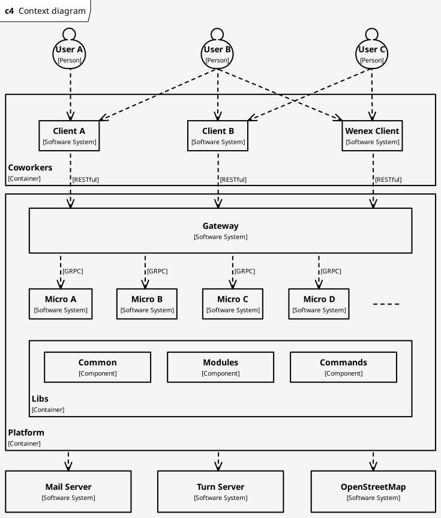
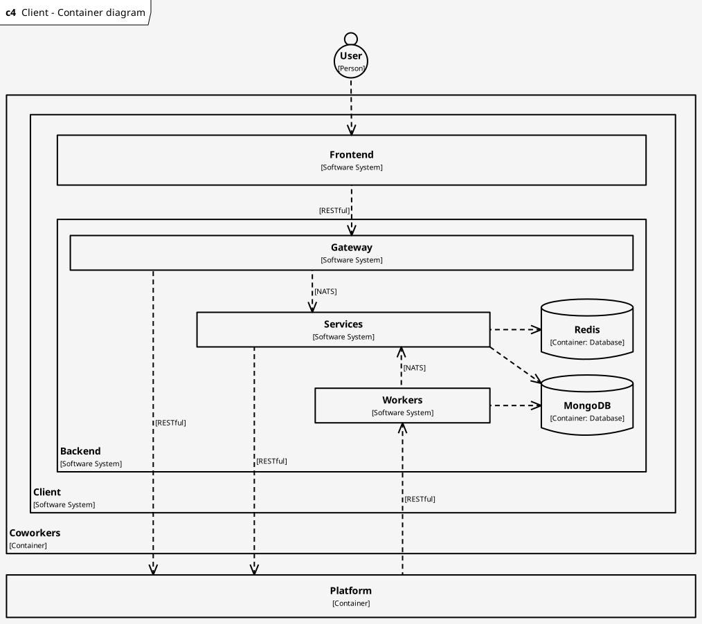
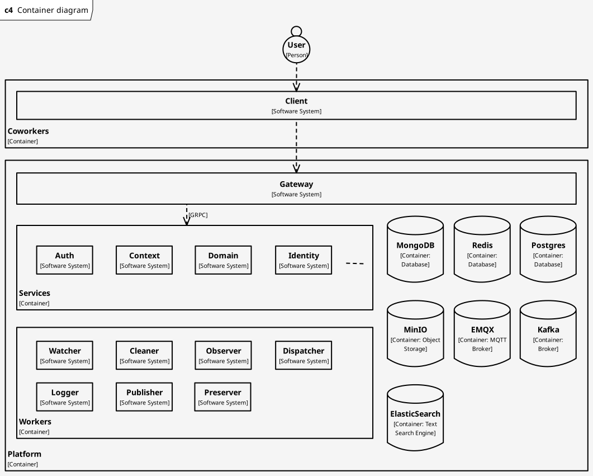

# C4 Model

1. [Context Diagram](#context-diagram)
2. [Container Diagram](#container-diagram)

## Context Diagram

## Container Diagram

- [Client Container Diagram](#client-container-diagram)
- [Platform Container Diagram](#platform-container-diagram)

### Client Container Diagram

### Platform Container Diagram

