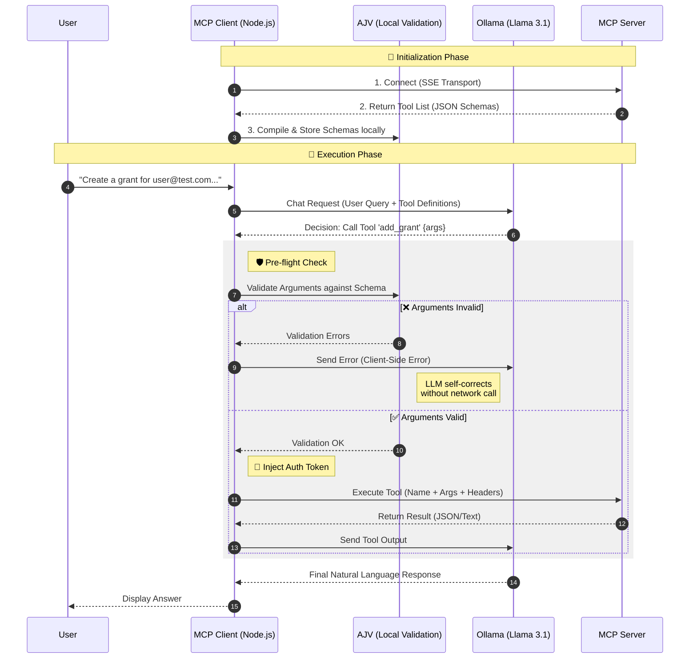

```mermaid
sequenceDiagram
    autonumber
    participant User
    participant App as MCP Client (Node.js)
    participant Validator as AJV (Local Validation)
    participant LLM as Ollama (Llama 3.1)
    participant Server as MCP Server

    Note over App, Server: 🔌 Initialization Phase
    App->>Server: 1. Connect (SSE Transport)
    Server-->>App: 2. Return Tool List (JSON Schemas)
    App->>Validator: 3. Compile & Store Schemas locally

    Note over User, Server: 🚀 Execution Phase
    User->>App: "Create a grant for user@test.com..."
    App->>LLM: Chat Request (User Query + Tool Definitions)
    LLM-->>App: Decision: Call Tool 'add_grant' {args}

    rect rgb(240, 240, 240)
        Note right of App: 🛡️ Pre-flight Check
        App->>Validator: Validate Arguments against Schema

        alt ❌ Arguments Invalid
            Validator-->>App: Validation Errors
            App->>LLM: Send Error (Client-Side Error)
            Note left of LLM: LLM self-corrects<br/>without network call
        else ✅ Arguments Valid
            Validator-->>App: Validation OK
            Note right of App: 💉 Inject Auth Token
            App->>Server: Execute Tool (Name + Args + Headers)
            Server-->>App: Return Result (JSON/Text)
            App->>LLM: Send Tool Output
        end
    end

    LLM-->>App: Final Natural Language Response
    App-->>User: Display Answer
```
